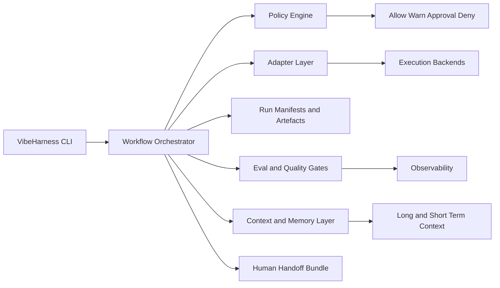
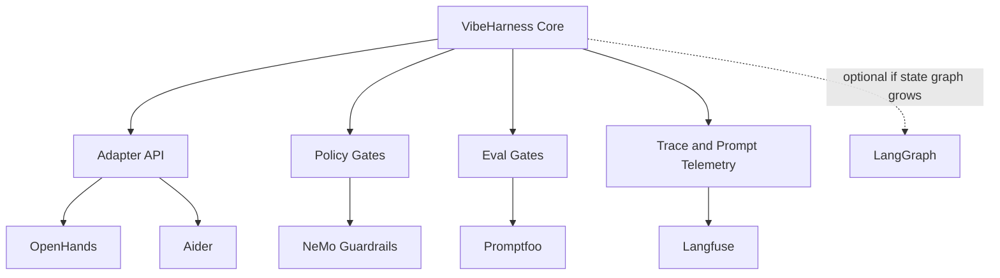

# VibeHarness Repository Assessment

Status: historical assessment. The active planning bundle now supersedes this report for implementation sequencing: OpenCode is the first planned real adapter, OpenHands is secondary, Mem0 is the concrete memory sidecar, and Hermes is deferred export/interchange. Treat older OpenHands-first recommendations below as research context, not project contract.

## Executive summary

The strongest conclusion I can support is that **VibeHarness is intended to be a local-first TypeScript/Bun “conductor” for coding work**: a thin orchestration layer that coordinates agent backends, enforces deterministic stage transitions and policy gates, records manifests and artefacts, and prepares clean human handoffs rather than trying to be a monolithic agent system in its own right. That is explicit in the attached design artefact, which describes VibeHarness as a CLI conductor with adapters, policy control and evidence-preserving outputs, and prioritises permissive licensing, active maintenance, model agnosticism and local-first operation. fileciteturn0file0L18-L34 fileciteturn0file0L398-L400

I could **not** code-verify the current repository state from GitHub in this session. The repository root URL and attempted manifest paths were not fetchable through the available browser path, so I could not inspect `package.json`, `bun.lock`, a `LICENSE` file, or the live source tree. That means I cannot truthfully provide a package-accurate SBOM, a direct/indirect dependency map, or a verified repository licence for the current repo snapshot. citeturn0view0turn39view0

Given that limitation, the most defensible technical recommendation is to keep VibeHarness **small, policy-centric and adapter-driven**, and to integrate battle-tested open-source components at the edges. The best-fit stack, based on the design goals in the attached artefact and current upstream project health, is: **OpenHands** for rich multi-backend execution; **Aider** for lightweight terminal-first editing flows; **Promptfoo** for regression, eval and red-team gates; **Langfuse** for traces, sessions and prompt/version observability; and **NeMo Guardrails** when stronger programmable safety rails are needed. By contrast, **AutoGen** is explicitly in maintenance mode, and **Continue** is explicitly marked as no longer actively maintained/read-only in its old repository, so both are poor foundations for a new control plane. fileciteturn0file0L18-L34 fileciteturn0file0L408-L416 citeturn48view0turn49view1turn65view4turn65view0turn66view2turn59view0turn61view0turn66view4

## Evidence base and scope limitations

This report combines two evidence bases. The first is the **attached design artefact**, which provides a detailed description of what VibeHarness is supposed to be: a local-first TypeScript/Bun CLI conductor that manages deterministic workflow stages, policy gates, manifests, artefacts, memory/eval hooks, and human-handoff bundles, while surveying a wide ecosystem of candidate open-source tools for execution, orchestration, memory, workflow, observability and safety. fileciteturn0file0L18-L34 fileciteturn0file0L51-L97 fileciteturn0file0L99-L173 fileciteturn0file0L175-L191

The second evidence base is a set of **primary upstream sources for comparable open-source projects**: official documentation, GitHub repository pages, commit histories and release notes. Those sources are sufficient to assess maintenance signals, licences, feature fit, and migration attractiveness for replacement or augmentation candidates. They are not sufficient to manufacture a verified dependency inventory for VibeHarness itself. citeturn48view0turn49view1turn42view0turn48view2turn52view0turn55view0turn55view2turn59view0turn52view2

The practical consequence is important: **the request items that depend on the live VibeHarness manifests cannot be completed without speculation**. Specifically, I cannot verify: the repository’s purpose from its live README; its actual package architecture from source files; the current dependency graph; versions of direct and indirect packages; package-by-package security advisories; or the repository’s live licence file. A truthful report therefore has to distinguish between **verified design intent** and **unverified current implementation state**. citeturn0view0turn39view0

## Verified product shape and inferred architecture

Based on the attached design artefact, VibeHarness is best understood as a **governance and workflow harness around coding agents**, not as a substitute for all the specialised subsystems it references. The prompt repeatedly frames it as a conductor that should remain small, composable and decoupled, and that should use existing open-source systems where they are already excellent. In other words, VibeHarness’s durable value is in policy, state transitions, evidence capture, adapter normalisation and handoff discipline. fileciteturn0file0L18-L34 fileciteturn0file0L408-L416

That implies the following architecture, which is **an inference from the design artefact, not a verified repository diagram**. The core should stay in TypeScript/Bun and expose a small orchestration API; everything operationally heavy should sit behind adapters or service boundaries. That design also aligns with the prompt’s explicit ranking criteria: permissive licensing, active maintenance, model agnosticism and local-first operation first; speed, plugin ecosystem and UX second. fileciteturn0file0L18-L34 fileciteturn0file0L398-L400

A reasonable decomposition, consistent with the design artefact and with the ecosystem it surveys, is the following. The **orchestrator** owns stage transitions and run identity; the **policy engine** decides whether a run is allowed, blocked or requires approval; the **adapter layer** translates a common task contract into backend-specific invocation formats; the **artefact store** captures prompts, diffs, tool outputs and handoff notes; the **eval layer** drives automated checks and red-team or regression suites; and the **memory/context layer** is optional rather than foundational. That decomposition is exactly where the compared external projects fit. fileciteturn0file0L22-L34 fileciteturn0file0L51-L97 fileciteturn0file0L99-L173

## Repository dependency position

The current repository’s **direct and indirect dependency inventory is not verifiable from the accessible evidence**. I could not inspect a live `package.json`, Bun lockfile or licence file, so I cannot safely fill in names, versions, where-used locations, direct/indirect status or package licences for the actual checked-in code. Any attempt to do so would be a hallucinated SBOM. citeturn0view0turn39view0

What *is* visible is the design artefact’s **ecosystem shortlist**. It explicitly surveys open-source candidates across execution backends, orchestration frameworks, memory/context layers, workflow engines, eval/observability stacks, and safety libraries. That strongly suggests the intended repository architecture is one that **adapts or embeds external systems selectively** rather than re-implementing their functionality from scratch. fileciteturn0file0L51-L97 fileciteturn0file0L99-L173 fileciteturn0file0L175-L191

A concise way to think about the current dependency position is therefore this:

| Question | Verified answer |
|---|---|
| Live repo purpose, architecture, dependencies, licence | **Not code-verified in this session** because the repository and raw manifest paths were not fetchable through the available browser path. citeturn0view0turn39view0 |
| Intended product shape | **Yes**: local-first TypeScript/Bun conductor with deterministic stages, policy gates, manifests, adapters and handoff outputs. fileciteturn0file0L18-L34 |
| Design priorities for choosing dependencies | **Yes**: permissive licence, active maintenance, model-agnostic support and local-first operation are primary. fileciteturn0file0L398-L400 |
| Fitness criteria for alternatives | **Yes**: architecture fit, policy fit, local/offline support, extensibility, eval maturity, maintenance, portability and licence are all explicitly prioritised. fileciteturn0file0L408-L416 |

That means the right next step is not to pretend there is a precise package inventory; it is to choose a **reference architecture and replacement stack** that match the documented VibeHarness goals, and to structure VibeHarness so that package audit work can be made exact later once the manifests are inspectable. fileciteturn0file0L18-L34 fileciteturn0file0L408-L416

## Compared open-source alternatives

The table below compares the **best-fit open-source projects** for the functions VibeHarness appears to need. It intentionally mixes “execution backends”, “orchestration libraries”, “eval/observability” and “guardrails”, because the design artefact itself treats VibeHarness as a coordinator across those domains rather than a single-purpose library. fileciteturn0file0L51-L173

| Name | Language | Licence | Maturity | Key features | Pros | Cons | Migration effort estimate |
|---|---|---|---|---|---|---|---|
| **OpenHands** | Python + TypeScript | MIT for the main OSS work; `enterprise/` is source-available and separately licensed. citeturn67view1 | 78.5k stars; latest visible release `cloud-1.40.0` on **26 June 2026**; commit history visible on **23 June 2026**. citeturn48view0turn50view0turn51view0 | Agent Canvas, CLI, SDK, local/default operation with local, remote and cloud backends; ACP-compatible ecosystem; legacy local GUI with REST API. citeturn48view0turn49view1 | Best match for a VibeHarness adapter target because it already models local/remote execution backends, self-hosting and automation workflows. Its release notes also show active dependency hygiene, including fixes for CVE-2026-54285, CVE-2026-48712, CVE-2026-48779 and GHSA-4xgf-cpjx-pc3j. citeturn50view0 | More platform than library; Python-heavy; part of the broader offering is source-available rather than purely permissive OSS. | **Medium** — about **5–8 developer-days** to add a backend adapter plus integration tests. |
| **Aider** | Python | Apache-2.0. citeturn65view4 | 46.8k stars; latest visible release `v0.86.0` on **9 August 2025**; commit history visible on **22 May 2026**. citeturn65view4turn47view0 | Terminal-first pair programming, git integration, codebase map, local/cloud model support, linting/testing loops, IDE-friendly workflow. citeturn42view0turn65view4 | Excellent lightweight execution backend when VibeHarness wants a subprocess-style adapter instead of a full agent platform. Particularly attractive for repo-local edits and git-centric flows. | Not a workflow engine; Python subprocess boundary required from Bun/TypeScript; fewer “platform” controls than OpenHands. | **Low to medium** — about **2–4 developer-days**. |
| **Continue** | TypeScript | Apache-2.0. citeturn66view4 | 34.5k stars; latest visible release `v2.0.0-vscode` on **19 June 2026**; commit history visible on **19 June 2026**. But the README also says the repo is “no longer actively maintained” and “read-only”. citeturn66view4turn64view0 | CLI, VS Code extension and JetBrains plugin; highly relevant TypeScript codebase and configuration model. citeturn66view4 | Useful as a **reference implementation** for TypeScript ergonomics, config design and IDE flows. | Strategic risk is high because the project itself says the repository is no longer actively maintained/read-only. I would not build a new governance plane around it. | **Medium** if used only as inspiration; **high strategic risk** if used as a core runtime. |
| **LangGraph** | Python + JS/TS | MIT. citeturn52view0 | 35.9k stars; latest visible release `1.2.6` on **18 June 2026**. citeturn52view0turn53view0 | Durable execution, human-in-the-loop checkpoints, memory, long-running stateful workflows; explicit JS/TS variant available. citeturn52view0 | Best fit if VibeHarness needs to graduate from a simple deterministic state machine to a graph-based orchestration runtime. | Adds framework weight. If VibeHarness’s own stage machine is intentionally small and deterministic, LangGraph may be overkill. | **Medium to high** — about **7–12 developer-days** if adopted for core orchestration. |
| **Promptfoo** | TypeScript/Node | MIT. citeturn65view0 | 22.6k stars; latest visible release `0.121.17` on **16 June 2026**; commit history visible on **23 June 2026**. citeturn57view0turn58view0 | CLI and library for evals, agent/RAG testing, red teaming, CI/CD automation and code scanning. citeturn65view0turn56view1 | Extremely strong complement to VibeHarness because it gives the harness measurable acceptance gates instead of subjective “it worked” judgments. Node/TS fit is excellent. | Not an execution backend or orchestration framework; it belongs in the quality gate layer rather than the core runtime. | **Low** — about **2–3 developer-days** for an initial regression suite. |
| **Langfuse** | TypeScript + web services | MIT except for `ee` folders. citeturn66view2 | 29.9k stars; latest visible release `v3.201.1` on **26 June 2026**; commit history visible on **18 June 2026**. citeturn56view2turn57view1turn58view1 | Traces, sessions, metrics, prompt management, experiments, prompt playground, OTel alignment, JS SDK and many integrations. citeturn56view3turn66view2 | Best fit for the observability layer because it covers both run tracing and prompt/version lifecycle, and can sit behind Bun/TS through native SDKs or OpenTelemetry. | Introduces an operational service. Also, teams with strict all-OSS requirements must stay out of the `ee` paths. | **Low to medium** — about **2–4 developer-days**. |
| **NeMo Guardrails** | Python | Apache-2.0. citeturn65view3 | 6.6k stars; latest released version explicitly called out as `0.21.0`; `develop` tracks top-of-tree. citeturn59view0 | Programmable guardrails for conversational applications; built-in rails for moderation, fact-checking, hallucination detection, jailbreak/injection detection; Colang DSL. citeturn59view0turn65view3 | Best fit when VibeHarness needs more than boolean allow/deny decisions and wants programmable, auditable safety policies. | Python boundary and Colang DSL add cognitive/operational overhead. Likely better as a sidecar service than an embedded library in a Bun CLI. | **Medium** — about **5–7 developer-days**. |
| **AutoGen** | Python + .NET | MIT for code, CC-BY-4.0 for docs. citeturn61view1 | 59.3k stars; latest visible release `python-v0.7.5` on **30 September 2025**; commit history visible on **6 April 2026**. citeturn61view1turn54view2 | Multi-agent framework with AgentChat, Core and Extensions layers, plus Studio. citeturn61view0turn54view4 | Historically important and architecturally influential. | The project explicitly says it is in **maintenance mode**, will not receive new features, and recommends new users start with Microsoft Agent Framework instead. That makes it a poor greenfield foundation for VibeHarness. citeturn61view0 | **Not recommended** for new integration work. |

Two patterns stand out. First, **execution and orchestration are best handled by different tools**: OpenHands or Aider for the former, LangGraph only if VibeHarness genuinely needs durable graph execution for the latter. Second, **quality gates and observability deserve first-class treatment**: Promptfoo and Langfuse map directly onto the prompt’s requirement for policy, evidence, evaluation and handoff discipline. fileciteturn0file0L18-L34 fileciteturn0file0L157-L173 citeturn48view0turn49view1turn65view4turn52view0turn65view0turn66view2

A third pattern is strategic rather than technical. **Continue** and **AutoGen** both have strong installed bases and valuable ideas, but each project now carries a clear platform-direction warning for greenfield work: Continue’s old repo says it is no longer actively maintained/read-only, and AutoGen says it is in maintenance mode and points new users elsewhere. Those are not fatal for borrowing ideas, but they are very strong reasons not to make them the backbone of a new governance layer. citeturn66view4turn61view0

The recommended augmentation stack for VibeHarness therefore looks like this:

## Recommended migration and integration roadmap

The most robust way to evolve VibeHarness is to preserve the harness’s own identity as a **thin policy-and-evidence control plane** and to externalise heavy behaviour into adapters and sidecars. Concretely, I would introduce a stable internal contract such as `runTask(request): RunResult`, where `request` contains a repo path, task spec, stage, policy context and resource limits, and `RunResult` standardises deltas, artefacts, metrics, tests, approvals and human-handoff notes. That contract lets the Bun/TypeScript core stay small while backends such as OpenHands and Aider remain replaceable. This is directly aligned with the attached design goals and with OpenHands/Aider’s existing execution models. fileciteturn0file0L18-L34 citeturn49view1turn65view4

For **OpenHands**, the best pattern is an **out-of-process backend adapter**. VibeHarness should translate its internal task contract into OpenHands CLI/SDK or agent-server invocations, and should treat OpenHands as a worker that can run locally first and later against remote or cloud backends without changing the harness contract. The code-level implication is that VibeHarness should normalise workspace mounting, environment-variable injection, budget/time limits, and result harvesting at the adapter boundary rather than leaking OpenHands semantics into the orchestrator. Testing should focus on adapter contract tests and replayable smoke tests against a sample repository. citeturn49view1turn48view0

For **Aider**, the integration can be lighter: a **subprocess adapter** that hands it a repo path, task goal, model target and optional lint/test command set. Because Aider already exposes git-centric workflows, codebase mapping and lint/test integration, it is a strong fit for “single-run editing sessions” or “interactive repair” stages. The code-level consideration is to keep Aider results wrapped in the same `RunResult` shape as OpenHands so that the policy and approval layers do not care which backend produced the change. Regression tests should compare generated diffs and exit-state metadata across a small set of fixed tasks. citeturn65view4turn42view0

For **Promptfoo**, I would treat it as a **mandatory quality gate** rather than an optional add-on. Each VibeHarness stage that produces user-visible prompts, agent plans or repository changes should emit a testable fixture; Promptfoo can then run regression evals, assertion checks or red-team suites before the harness advances to the next stage. Code-level work here is mostly schema discipline: ensure run artefacts are serialisable and stable, and generate fixture bundles that Promptfoo can read in CI and in local developer loops. The testing recommendation is simple: start with golden-path acceptance suites, then add adversarial and policy-violation suites once the basics are passing. citeturn65view0turn56view1

For **Langfuse**, the most natural fit is as the **trace and prompt telemetry substrate** behind VibeHarness. Every harness run should map to a session; every stage transition should emit a trace/span with latency, cost, model choice, policy decision and artefact identifiers; and every prompt/template revision should be versioned rather than being inlined ad hoc. The code-level implication is that VibeHarness should define a stable tracing schema early, ideally in a vendor-neutral way that can flow through Langfuse’s JS SDK or OpenTelemetry path. Testing should verify that a full run can be reconstructed from trace data alone. citeturn56view3turn66view2

For **NeMo Guardrails**, I would resist embedding it directly into the Bun CLI and instead use it as a **Python sidecar or policy microservice**. That keeps Colang and Python dependencies isolated while still allowing VibeHarness to call into programmable input/output checks, jailbreak screening or specialised response constraints when a policy rule requires them. The key API difference is that VibeHarness’s policy engine is likely stage-centric and backend-agnostic, whereas NeMo is conversation-rail-centric; the translation layer therefore needs to convert a harness event into a guardrail evaluation request and convert the returned result into `allow`, `warn`, `approval_required` or `deny`. Tests should include both deterministic policy fixtures and “nasty input” adversarial suites. fileciteturn0file0L22-L34 citeturn59view0turn65view3

For **LangGraph**, the recommendation is conditional. If VibeHarness’s own state machine remains intentionally small and mostly linear, keep it internal and avoid framework sprawl. If, however, VibeHarness starts to need resumability, branching subgraphs, human-in-the-loop checkpoints, and rich long-running state, LangGraph becomes attractive—especially because it explicitly supports those features and has a JS/TS equivalent. The migration cost would be noticeably higher than the other recommendations because it changes the control-plane model, not just a backend integration. citeturn52view0turn53view0

Two projects should be **de-prioritised**. **Continue** is worth mining for TypeScript UX patterns, configuration ergonomics and extension ideas, but not as a strategic dependency because its own repository warns that it is no longer actively maintained and read-only. **AutoGen** should be treated as legacy/reference material only, since the project explicitly states that it is in maintenance mode and tells new users to start elsewhere. citeturn66view4turn61view0

The following priority table puts that into an actionable roadmap:

| Recommendation | Priority | Why | Timebox |
|---|---|---|---|
| Add a **stable adapter interface** in TypeScript/Bun and keep VibeHarness core thin | **High** | This is the architectural move that preserves VibeHarness’s real value: policy, stage control and evidence output. fileciteturn0file0L18-L34 | **2–3 days** |
| Implement **OpenHands adapter** for full-featured execution backends | **High** | Best strategic fit for local/remote/cloud execution and automation. citeturn49view1turn50view0 | **5–8 days** |
| Implement **Aider adapter** for lightweight terminal-first editing | **High** | Cheapest high-value execution backend; good local-first fit. citeturn65view4turn47view0 | **2–4 days** |
| Add **Promptfoo** regression and red-team gates to CI and local runs | **High** | Gives VibeHarness measurable acceptance criteria and policy evidence. citeturn65view0turn56view1 | **2–3 days** |
| Add **Langfuse** tracing, sessions and prompt/version telemetry | **Medium** | Strong operational leverage, but only after adapter contracts stabilise. citeturn56view3turn66view2 | **2–4 days** |
| Add **NeMo Guardrails** as a sidecar policy service for stricter rails | **Medium** | Valuable once policy rules become richer than simple stage gates. citeturn59view0turn65view3 | **5–7 days** |
| Consider **LangGraph** only if resumable graph workflows become a first-order need | **Low to medium** | Powerful, but it changes the orchestration model and adds framework gravity. citeturn52view0turn53view0 | **7–12 days** |
| Use **Continue** and **AutoGen** only as design references, not runtime foundations | **Low** | Their own upstream guidance argues against greenfield dependency on them. citeturn66view4turn61view0 | **0–1 day** |

The critical testing advice is to make the test surface **contract-first**. Do not begin with end-to-end “agent vibe” tests. Begin with adapter contract tests, policy decision golden tests, Promptfoo acceptance suites, and trace-validation tests. Once those are deterministic, add end-to-end integration runs against a small seed repository. That approach matches the design artefact’s emphasis on deterministic stages, policy fitness and evidence-based handoff rather than on unconstrained agent autonomy. fileciteturn0file0L22-L34 fileciteturn0file0L408-L416

The one thing this report cannot responsibly do is pretend to have inspected VibeHarness’s actual dependency manifests when it did not. The recommendations above are therefore deliberately shaped to be **implementation-ready without requiring that fiction**: they tell you which upstream projects fit VibeHarness’s documented goals, which ones to avoid, and how to wire them in without collapsing VibeHarness into yet another heavyweight agent framework. citeturn0view0turn39view0
